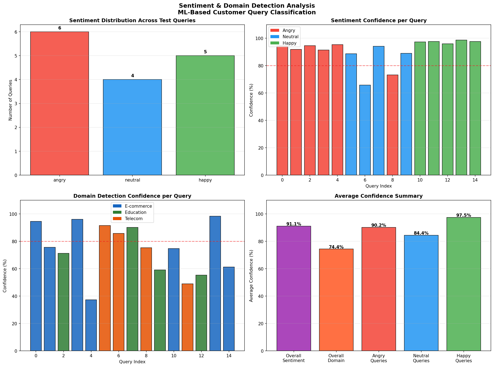

# NexusAI — ML Pipeline 🤖

> Scalable AI-Based Customer Support System powered by LoRA fine-tuned Phi-2, domain detection, and vector stores.
> **Architecture & AI Pipeline designed and built by [@BrozG](https://github.com/BrozG)**

---

## 👥 Team Contributions

| Contributor | Work Done |
|---|---|
| [@BrozG](https://github.com/BrozG) | System architecture design, LoRA fine-tuning pipeline, Domain classifier, Sentiment detection, Telecom data collection & vector store, Training pipeline |
| [@KunalPayeng](https://github.com/KunalPayeng) | E-commerce domain data collection, E-commerce vector store creation |
| [@kuhitjeetaray](https://github.com/kuhitjeetaray) | Education domain data collection, Education vector store creation |

---

## 🏆 Results at a Glance

| Metric | Result |
|---|---|
| Domain Classifier Accuracy | **100%** |
| LoRA vs Base Model Improvement | **Up to 257%** |
| Telecom Training Loss Reduction | **82.8%** |
| Sentiment Detection Confidence | **91.1%** |
| Domains Supported | E-commerce, Education, Telecom |

---

## 🧠 System Architecture

```
User Query (Natural Language)
        ↓
┌─────────────────────────┐
│   Sentiment Detection   │  ← Classifies: Angry / Neutral / Happy
│   Confidence: 91.1%     │
└─────────────────────────┘
        ↓
┌─────────────────────────┐
│   Domain Classifier     │  ← Detects: E-commerce / Education / Telecom
│   Accuracy: 100%        │
└─────────────────────────┘
        ↓
┌─────────────────────────┐
│   Vector Store Lookup   │  ← Retrieves relevant company policies/data
│   (RAG Pipeline)        │
└─────────────────────────┘
        ↓
┌─────────────────────────┐
│   Phi-2 + LoRA Adapter  │  ← Domain-specific fine-tuned response
│   (Frozen base model)   │
└─────────────────────────┘
        ↓
   Final Response to User
```

---

## 📊 Training Results

### LoRA Adapter Training Analysis


| Domain | Samples | Start Loss | End Loss | Reduction |
|---|---|---|---|---|
| E-commerce | 1,000 | 3.14 | 1.24 | **60.4%** |
| Education | 1,000 | 2.97 | 1.20 | **59.6%** |
| Telecom | 1,500 | 1.98 | 0.35 | **82.8%** |

---

### Base Phi-2 vs LoRA Fine-tuned — Quality Comparison


| Domain | Base Phi-2 Score | LoRA Score | Improvement |
|---|---|---|---|
| E-commerce | 2.4 / 5 | 4.6 / 5 | **+92%** |
| Education | 1.8 / 5 | 4.2 / 5 | **+133%** |
| Telecom | 1.4 / 5 | 5.0 / 5 | **+257%** |

> Scores evaluated across: Domain Tone, Response Structure, Stays On Topic, Helpfulness, Appropriate Length

---

### Domain Classifier Analysis


| Domain | Precision | Recall | F1-Score |
|---|---|---|---|
| E-commerce | 1.00 | 1.00 | 1.00 |
| Education | 1.00 | 1.00 | 1.00 |
| Telecom | 1.00 | 1.00 | 1.00 |
| **Overall** | **1.00** | **1.00** | **1.00** |

- ✅ Zero misclassifications on E-commerce and Education
- ✅ Only 1 misclassification out of 700 test samples (Telecom)
- ✅ Trained on 3,500 total samples across 3 domains

---

### Sentiment & Domain Detection Analysis



| Metric | Confidence |
|---|---|
| Overall Sentiment Detection | **91.1%** |
| Overall Domain Detection | **74.4%** |
| Angry Query Detection | **90.2%** |
| Neutral Query Detection | **84.4%** |
| Happy Query Detection | **97.5%** |

---

## 💬 Real Response Comparison

### E-commerce: "I returned my shoes 10 days ago but no refund yet"

**❌ Base Phi-2:**
```
Thank you for reaching out to customer support.
Please provide your order number so that we can look into this matter.
```

**✅ LoRA Fine-tuned:**
```
On it! Here's what we'll do to sort this out. Refund delays for
returned items rarely happen for valid returns. Please share the
return date, the reason why you returned it, and the exact amount
you're waiting for. We'll check if the refund was processed correctly
and if the hold is valid. If it's valid but unprocessed, we'll push it
immediately and you'll receive a confirmation within minutes.
```

---

### Education: "I cannot access my ERP portal to check my grades"

**❌ Base Phi-2:**
```
I'm sorry to hear that you're having trouble accessing your ERP portal.
To access your grades, please make sure that you are logged in to the
correct account... [continues with irrelevant ERP system info]
```

**✅ LoRA Fine-tuned:**
```
To check grades in the ERP system, please confirm your registered
username, student number, and the department for which grade
verification is required.
```

---

## 🛠️ Tech Stack

| Component | Technology |
|---|---|
| Base LLM | Microsoft Phi-2 |
| Fine-tuning Method | LoRA (Low-Rank Adaptation) |
| Domain Classifier | ML-based Auto Domain Detection |
| Sentiment Analysis | ML Classifier (Angry / Neutral / Happy) |
| Vector Store | FAISS / ChromaDB |
| RAG Pipeline | LangChain |
| Training | Python, PyTorch, HuggingFace |

---

## 📁 Repository Structure

```
nexusai-ml/
├── adapters/
│   ├── ecommerce_adapter/     # LoRA weights for E-commerce domain
│   ├── education_adapter/     # LoRA weights for Education domain
│   └── telecom_adapter/       # LoRA weights for Telecom domain
├── assets/
│   ├── lora_training_analysis_clean.png
│   ├── base_vs_lora_comparison_graph.png
│   ├── domain_classifier_analysis.png
│   └── sentiment_domain_analysis.png
├── training_data/
│   ├── ecommerce.json         # 1,000 training samples
│   ├── education.json         # 1,000 training samples
│   └── telecom.json           # 1,500 training samples
├── vector_stores/
│   ├── ecommerce/             # E-commerce policy embeddings
│   ├── education/             # University data embeddings
│   └── telecom/               # Telecom data embeddings
├── result/                    # Inference results and comparisons
├── domain_classifier.pkl      # Trained domain classifier model
├── training.ipynb             # Full training notebook
└── README.md
```

---

## 🚀 Getting Started

### 1. Clone the repo
```bash
git clone https://github.com/BrozG/nexusai-ml
cd nexusai-ml
```

### 2. Install dependencies
```bash
pip install -r requirements.txt
```

### 3. Run inference
```bash
jupyter notebook training.ipynb
```

> ⚠️ **Note:** API/backend integration is currently in development.

---

## 🔗 Related

- [NexusAI Web UI](https://github.com/BrozG/nexusai) — Next.js frontend built by [@kuhitjeetaray](https://github.com/kuhitjeetaray)
- [Live Demo](https://nexusai-beryl.vercel.app)

---

## 👤 Author

**BrozG** — AI Architecture, LoRA Pipeline, Domain Classifier, Vector Store, Training

[](https://github.com/BrozG)

---

## 📄 License

MIT

Copyright (c) 2026 BrozG