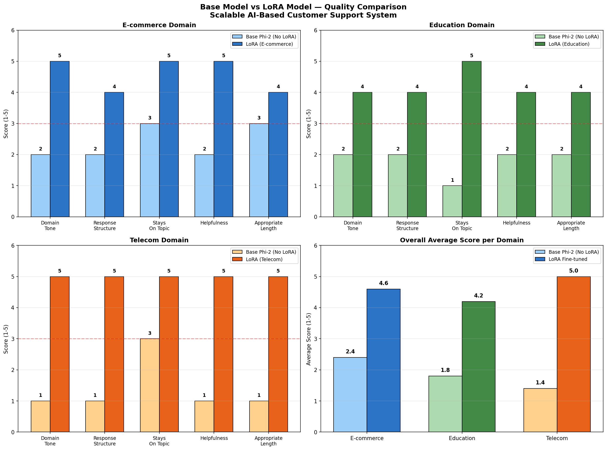
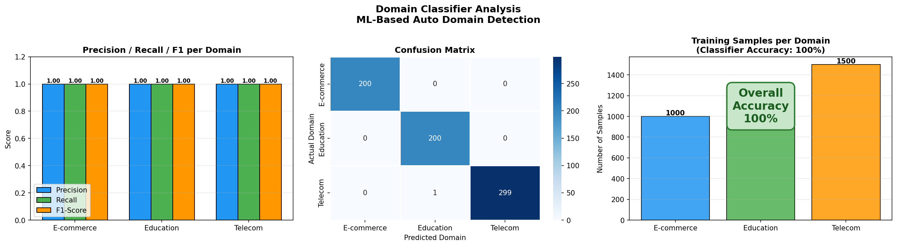

# NexusAI - ML Pipeline

> Scalable AI-Based Customer Support System powered by LoRA fine-tuned Phi-2, domain detection, and vector stores.
> **Architecture & AI Pipeline designed and built by [@BrozG](https://github.com/BrozG)**

---

## Team Contributions

| Contributor | Work Done |
|---|---|
| [@BrozG](https://github.com/BrozG) | System architecture design, LoRA fine-tuning pipeline, Domain classifier, Sentiment detection, Telecom data collection & vector store, Training pipeline |
| [@KunalPayeng](https://github.com/KunalPayeng) | E-commerce domain data collection, E-commerce vector store creation |
| [@kuhitjeetaray](https://github.com/kuhitjeetaray) | Education domain data collection, Education vector store creation |

---

## Results at a Glance

| Metric | Result |
|---|---|
| Domain Classifier Accuracy | **100%** |
| LoRA vs Base Model Improvement | **Up to 257%** |
| Telecom Training Loss Reduction | **82.8%** |
| Sentiment Detection Confidence | **91.1%** |
| Domains Supported | E-commerce, Education, Telecom |

---

## System Architecture

```
User Query (Natural Language)
        |
        v
+-------------------------+
|   Sentiment Detection   |  <- Classifies: Angry / Neutral / Happy
|   Confidence: 91.1%     |
+-------------------------+
        |
        v
+-------------------------+
|   Domain Classifier     |  <- Detects: E-commerce / Education / Telecom
|   Accuracy: 100%        |
+-------------------------+
        |
        v
+-------------------------+
|   Vector Store Lookup   |  <- Retrieves relevant company policies/data
|   (RAG Pipeline)        |
+-------------------------+
        |
        v
+-------------------------+
|   Phi-2 + LoRA Adapter  |  <- Domain-specific fine-tuned response
|   (Frozen base model)   |
+-------------------------+
        |
        v
   Final Response to User
```

---

## Repository Structure

```
nexusai-ml/
├── adapters/
│   ├── ecommerce_adapter/     # LoRA weights for E-commerce domain
│   ├── education_adapter/     # LoRA weights for Education domain
│   └── telecom_adapter/       # LoRA weights for Telecom domain
├── assets/                    # Training analysis images
├── training_data/             # Training samples (JSON format)
├── result/                    # Inference results and comparisons
│
├── # Core Pipeline Files
├── universal_fetcher.py       # Web scraping with change detection
├── pdf_handler.py             # Document processing (extract + save original)
├── vector_builder.py          # FAISS vector store builder
├── simple_rag.py              # RAG search + generation
│
├── # Generated at Runtime (gitignored)
├── raw_data/                  # Extracted text from URLs/PDFs
├── vector_stores/             # FAISS indexes and metadata
├── policies/                  # Original uploaded PDFs
├── url_tracker.json           # URL change tracking database
│
├── domain_classifier.pkl      # Trained domain classifier model
├── training.ipynb             # Full training notebook
├── requirements.txt           # Python dependencies
└── README.md
```

---

## Installation

```bash
# Clone the repo
git clone https://github.com/BrozG/nexusai-ml
cd nexusai-ml

# Install dependencies
pip install -r requirements.txt
```

---

## Data Pipeline Usage

### 1. Universal Fetcher (Web Scraping)

Fetches text from URLs with SHA256 change detection and automatic scheduling.

```bash
# Show help
python universal_fetcher.py --help

# Fetch a single URL
python universal_fetcher.py --url "https://example.com/page" --domain education --company mit

# Fetch multiple URLs from a file
python universal_fetcher.py --url-file urls.txt --domain ecommerce --company amazon

# Check all tracked URLs for changes
python universal_fetcher.py --check-updates

# Start scheduled updates (runs nightly at 2 AM)
python universal_fetcher.py --schedule

# Clean up old data (older than 30 days)
python universal_fetcher.py --cleanup --days 30
```

**URL File Format (urls.txt):**
```
https://example.com/help
https://example.com/faq
https://example.com/policies
```

**Output Structure:**
```
raw_data/
└── education/
    └── mit/
        ├── url_example_com_help.txt
        ├── url_example_com_faq.txt
        └── url_example_com_policies.txt
```

---

### 2. PDF Handler (Document Processing)

Extracts text from PDF, DOCX, and TXT files. Optionally saves original files.

```bash
# Show help
python pdf_handler.py --help

# Extract text only (saves to raw_data/)
python pdf_handler.py --file document.pdf --domain ecommerce --company amazon

# Save original + extract text (saves to policies/ AND raw_data/)
python pdf_handler.py --file document.pdf --domain ecommerce --company amazon --save-original

# List saved files
python pdf_handler.py --list --domain ecommerce --company amazon
```

**Python API (for WebUI):**
```python
from pdf_handler import handle_pdf, handle_pdf_with_original

# Extract text only
result = handle_pdf(file_bytes, "ecommerce", "amazon", "policy.pdf")
# -> raw_data/ecommerce/amazon/pdf_policy.txt

# Save original + extract text
result = handle_pdf_with_original(file_bytes, "ecommerce", "amazon", "policy.pdf")
# -> policies/ecommerce/amazon/policy.pdf
# -> raw_data/ecommerce/amazon/pdf_policy.txt
```

**Output Structure:**
```
policies/                      # Original files (--save-original)
└── ecommerce/amazon/policy.pdf

raw_data/                      # Extracted text
└── ecommerce/amazon/pdf_policy.txt
```

---

### 3. Vector Builder (FAISS Index)

Builds searchable vector stores from extracted text.

```bash
# Show help
python vector_builder.py --help

# Build vector store for specific domain/company
python vector_builder.py --build --domain education --company mit

# Build all vector stores
python vector_builder.py --build-all

# Watch mode (auto-rebuild on file changes)
python vector_builder.py --watch

# Rebuild specific vector store
python vector_builder.py --rebuild --domain ecommerce --company amazon

# Get vector store statistics
python vector_builder.py --stats
```

**Output Structure:**
```
vector_stores/
└── education/
    └── mit/
        ├── vector.index       # FAISS index file
        └── metadata.json      # Chunk metadata and sources
```

---

### 4. Simple RAG (Search & Generation)

Simplified RAG without domain classifier - you specify domain/company directly.

```bash
# Show help
python simple_rag.py --help

# Search only (no generation)
python simple_rag.py --search "refund policy" --domain ecommerce --company amazon

# Search with more results
python simple_rag.py --search "grades" --domain education --company mit --top-k 5

# Full RAG (search + generate with Phi-2 + LoRA)
python simple_rag.py --generate "How do I get a refund?" --domain ecommerce --company amazon

# Interactive mode
python simple_rag.py --interactive --domain telecom --company airtel
```

**Search Output Example:**
```
Query: "refund policy"
Domain: ecommerce/amazon

Results:
1. [Relevance: 0.89] Source: pdf_refund_policy.txt
   "Returns are accepted within 30 days of purchase..."

2. [Relevance: 0.76] Source: url_help_center.txt
   "To request a refund, go to Your Orders..."
```

---

## Complete Workflow Example

```bash
# Step 1: Fetch data from web
python universal_fetcher.py --url "https://mit.edu/admissions" --domain education --company mit

# Step 2: Process PDF documents
python pdf_handler.py --file handbook.pdf --domain education --company mit

# Step 3: Build vector store
python vector_builder.py --build --domain education --company mit

# Step 4: Search the knowledge base
python simple_rag.py --search "admission requirements" --domain education --company mit

# Optional: Start watch mode for auto-updates
python vector_builder.py --watch
```

---

## Three-Tier Storage Architecture

```
policies/           ->    raw_data/           ->    vector_stores/
(Original Files)          (Extracted Text)          (FAISS Index)
     |                         |                         |
     v                         v                         v
  Untouched              Chunked text              Embeddings
  PDF/DOCX               for processing            for search
```

| Tier | Purpose | Contents |
|------|---------|----------|
| `policies/` | Original file archive | Untouched uploaded PDFs |
| `raw_data/` | Text extraction | Extracted text from URLs/PDFs |
| `vector_stores/` | Search index | FAISS vectors + metadata |

---

## Training Results

### LoRA Adapter Training Analysis


| Domain | Samples | Start Loss | End Loss | Reduction |
|---|---|---|---|---|
| E-commerce | 1,000 | 3.14 | 1.24 | **60.4%** |
| Education | 1,000 | 2.97 | 1.20 | **59.6%** |
| Telecom | 1,500 | 1.98 | 0.35 | **82.8%** |

---

### Base Phi-2 vs LoRA Fine-tuned - Quality Comparison



| Domain | Base Phi-2 Score | LoRA Score | Improvement |
|---|---|---|---|
| E-commerce | 2.4 / 5 | 4.6 / 5 | **+92%** |
| Education | 1.8 / 5 | 4.2 / 5 | **+133%** |
| Telecom | 1.4 / 5 | 5.0 / 5 | **+257%** |

---

### Domain Classifier Analysis



| Domain | Precision | Recall | F1-Score |
|---|---|---|---|
| E-commerce | 1.00 | 1.00 | 1.00 |
| Education | 1.00 | 1.00 | 1.00 |
| Telecom | 1.00 | 1.00 | 1.00 |

---

## Tech Stack

| Component | Technology |
|---|---|
| Base LLM | Microsoft Phi-2 |
| Fine-tuning Method | LoRA (Low-Rank Adaptation) |
| Vector Store | FAISS (Facebook AI Similarity Search) |
| Embeddings | Sentence Transformers (all-MiniLM-L6-v2) |
| Web Scraping | BeautifulSoup4, Requests |
| Document Processing | PyPDF2, python-docx |
| Scheduling | APScheduler |
| File Monitoring | Watchdog |
| Training | Python, PyTorch, HuggingFace |

---

## Related

- [NexusAI Web UI](https://github.com/BrozG/nexusai) - Next.js frontend built by [@kuhitjeetaray](https://github.com/kuhitjeetaray)
- [Live Demo](https://nexusai-beryl.vercel.app)

---

## Author

**BrozG** - AI Architecture, LoRA Pipeline, Domain Classifier, Vector Store, Training

[](https://github.com/BrozG)

---

## License

MIT

Copyright (c) 2026 BrozG
